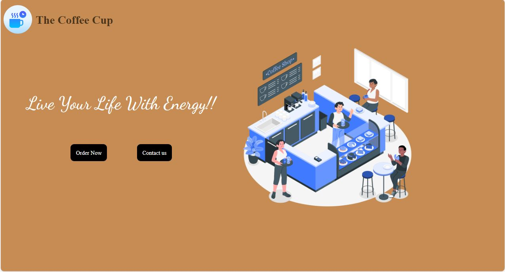

# The Coffee Cup ☕

This is a simple Web Development project created using HTML and CSS. It is about a Coffee Shop's site and called as **The Coffee Cup**.

## How to Contribute
We welcome contributions from the community! If you have any ideas for improvement, feature suggestions, bug reports, or code contributions, please feel free to submit an issue or create a pull request.We appreciate your help in making our platform even better!

## Getting Started
To get started with the Coffee shop Website, follow these steps :

1. Fork the repository to your GitHub account.
2. Make your changes, add new content, or fix any existing issues.
3. Add and Commit new changes and push the changes.
Open a new pull request in this repository.

## Contributors 

